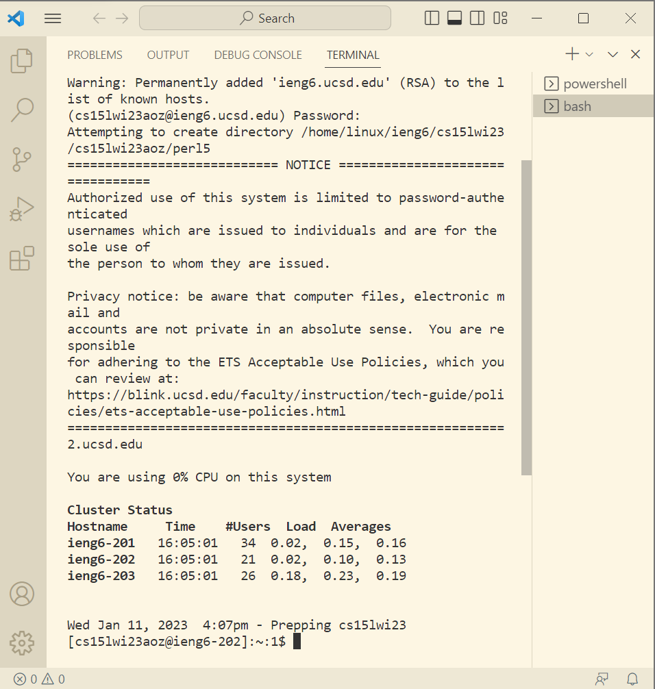
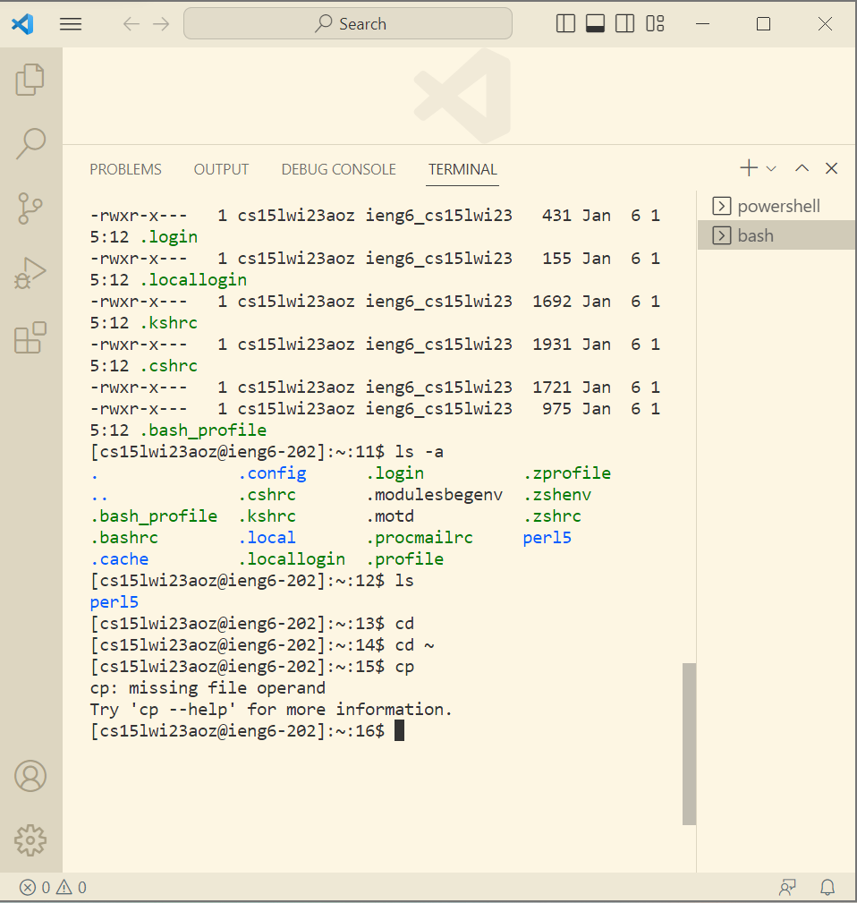

# Installing VScode
* Go to [Link](https://code.visualstudio.com/) to instal the right system for our computer
* After follow all of the instruction 

* Which mean the visualstudio is sucessful install 

# Remotely Connecting
For windows:
  * First install git bash [Link](https://git-scm.com/download/win)  then use VisualStudio to open it
  * Click Ctrl or Command + `, or use the Terminal → New Terminal menu option to get into the terminal we need 
  * Type in ssh with our own course-specific account such as cs15lwi23zz@ieng6.ucsd.edu, which zz is the specific letter for everyone
  * Then type in the password

  * Which is how remotely connecting sucessful look like

# Trying Some Commands
*  Try some special command like cd~, cd, ls -a

* cd, which means change directory

